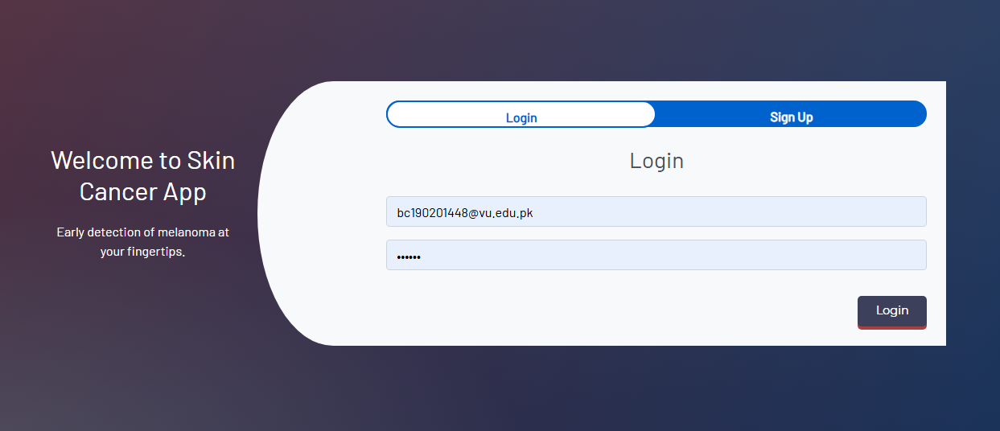
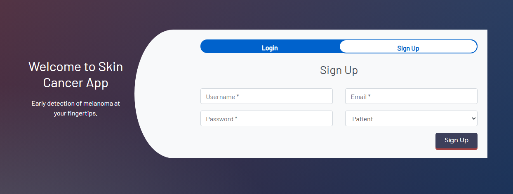
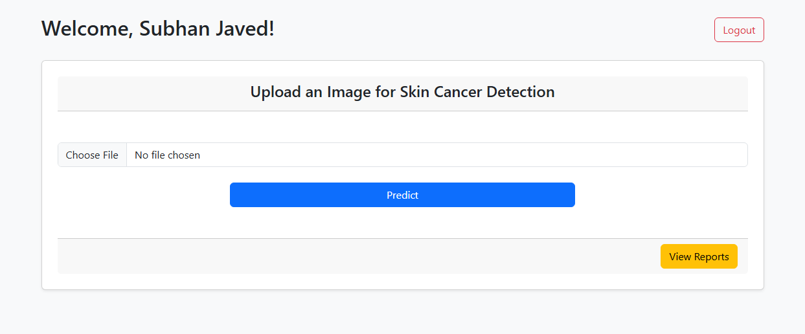
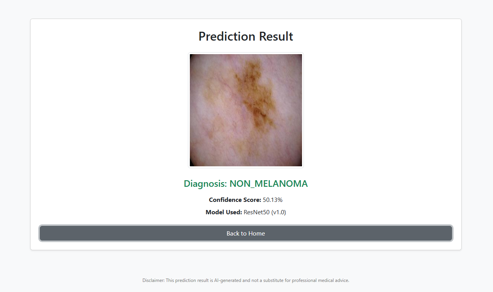
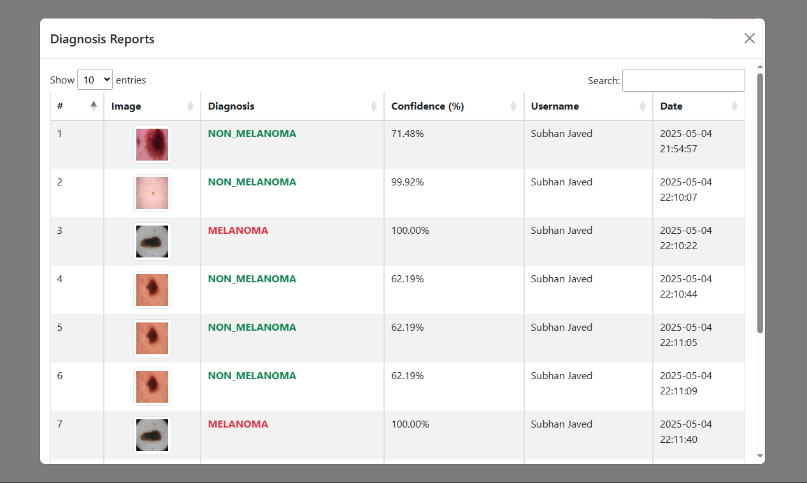
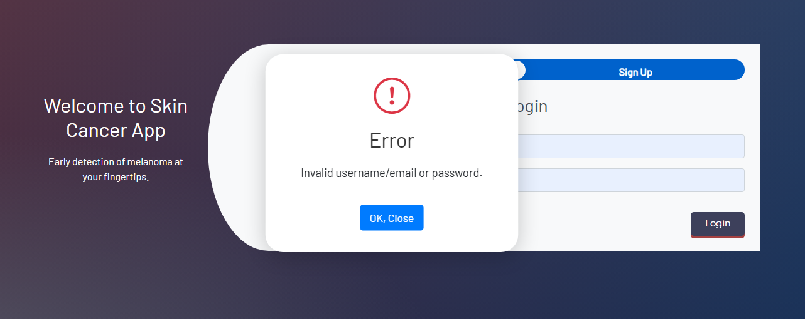

# 🔹 Skin Cancer Detection Web App

## Project Title: Skin Cancer Detection using CNN (Flask Web App)

**Course**: CS619 - Final Year Project
**Semester**: Fall 2024
**Student Name**: Subhan Javed
**Student ID**: BC190201448
**Supervisor**: Taliah Tajammal

---

## 📌 Project Description

This project is a deep learning-based web application for detecting skin cancer (Benign vs. Malignant) using Convolutional Neural Networks (CNNs). The model is trained on a publicly available Kaggle dataset (Hasnain Javed's Melanoma Dataset). Users can sign up, log in, and upload skin lesion images for diagnosis. The predicted results are saved in a SQLite database for future tracking and admin viewing.

**Dataset used**: [https://www.kaggle.com/datasets/hasnainjaved/melanoma-skin-cancer-dataset-of-10000-images/data?select=melanoma\_cancer\_dataset](https://www.kaggle.com/datasets/hasnainjaved/melanoma-skin-cancer-dataset-of-10000-images/data?select=melanoma_cancer_dataset)

---

## 🗂️ Directory Structure

```
SkinCancerWebApp/
|
├── app.py                        # Main Flask application
├── train_model.py               # CNN training script (used to create model file)
├── database.db                  # SQLite database file (auto-generated)
├── requirements.txt             # Required Python packages
|
├── model/
│   └── Skin_Cancer_CNN_Local.h5   # Trained CNN model
|
├── static/
│   └── uploads/                 # Uploaded images
|
├── templates/
│   ├── index.html               # Image upload form
│   ├── result.html              # Result display page
│   └── login.html               # Login/Signup form
|
└── README.md                    # This file
```

---

## ✅ FINAL DELIVERABLES vs My PROJECT

| Functional Requirement         | Status     | Notes                                           |
| ------------------------------ | ---------- | ----------------------------------------------- |
| 1. Dataset Collection          | ✅ Done     | Kaggle dataset by Hasnain Javed used            |
| 2. Preprocessing               | ✅ Done     | Resizing and normalization during training      |
| 3. Model Selection             | ✅ Done     | CNN built using Keras                           |
| 4. Dataset Splitting           | ✅ Done     | Train/Test split handled in directory structure |
| 5. Model Training              | ✅ Done     | `train_model.py` trains and saves model         |
| 6. Validation & Tuning         | ⚠️ Partial | No separate validation visuals/plots provided   |
| 7. Model Evaluation            | ✅ Done     | Accuracy evaluated in script                    |
| 8. User Interface              | ✅ Done     | Clean login, upload, result screens             |
| 9. Visual Feedback             | ✅ Done     | Image + prediction shown                        |
| 10. Python-only Implementation | ✅ Done     | Entire stack uses Python & Flask                |
| 11. Tools Usage                | ✅ Done     | Keras, Flask, SQLite, OpenCV                    |

---

## ⚠️ Additional Notes

* The CNN model file `Skin_Cancer_CNN_Local.h5` is stored in `/model` directory.
* User credentials are stored in plain text for demonstration purposes.
* Uploaded images are stored temporarily in `/static/uploads`.
* The database `database.db` is initialized and saved in the root directory.
* Admin can view all users' uploads and diagnosis records, while a user can only view their own.

**Disclaimer**: This app is for academic demonstration only. It is not intended for real medical use.

---

## 🛠️ How to Run

1. **Python Version Requirement**:
   This project is built and tested using:

   * Python 3.10.10
   * ⚠️ Note: TensorFlow and other packages may not be compatible with Python 3.11+ or 3.13.x.

2. Install dependencies:

```bash
pip install -r requirements.txt
```

3. Run the Flask app:

```bash
python app.py
```

4. Open in browser:

```
http://localhost:5000/
```

5. Demo Login Credentials:

* Email: [bc190201448@vu.edu.pk](mailto:bc190201448@vu.edu.pk) | Password: 123456
* Email: [testuser@vu.edu.pk](mailto:testuser@vu.edu.pk)    | Password: 123456
* Email: [demo@gmail.com](mailto:demo@gmail.com)        | Password: 123456

---

## 📆 LMS Submission Checklist

**Included:**

* ✅ All source code (.py)
* ✅ `model/Skin_Cancer_CNN_Local.h5`
* ✅ `database.db`
* ✅ All templates and static folders
* ✅ README file (this one)

**Excluded:**

* ❌ Old/unused scripts
* ❌ Personal test images
* ❌ IDE-specific or compiled files (.vscode/, .pyc, etc.)

---

## 📸 Preview Screenshots

### Login



### Signup



### User Dashboard - Image Upload



### User Dashboard - Detection Result



### User Dashboard - Detection Results Modal



### Login - Error message preview




### 🎥 Demo Video

[Watch on YouTube](https://your-youtube-demo-link.com) 

---

If you face issues running this project or have questions, feel free to contact me at: `subhanjavedsj3@gmail.com`

Thanks for checking out my final year project!
